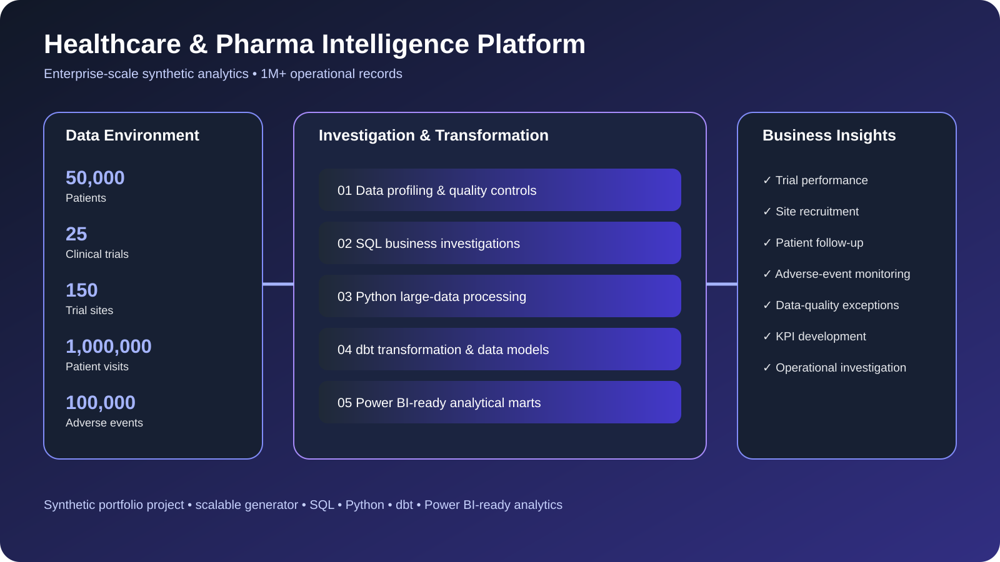

# 🧬 Healthcare & Pharma Intelligence Platform

> **Enterprise-scale synthetic healthcare & pharma analytics environment with 1M+ operational records.**

---

## 🎯 About the Project

A synthetic healthcare and pharmaceutical analytics platform built around a practical business question:

> **How can healthcare and pharma teams turn fragmented operational data into trustworthy insights for clinical operations, trial performance, patient follow-up and data-quality management?**

The project follows a **business-first analytics workflow**:

**Source Data → Profiling → Data Quality → Investigation → Transformation → Analytical Marts → Decision Support**

All datasets are synthetic and created specifically for portfolio demonstration.

---

## 🏢 Enterprise-Scale Data Environment

The platform is designed to simulate a large operational healthcare/pharma environment:

| Dataset                | Synthetic Records |
| ---------------------- | ----------------: |
| Patients               |        **50,000** |
| Clinical Trials        |            **25** |
| Trial Sites            |           **150** |
| Patient Visits         |     **1,000,000** |
| Adverse Events         |       **100,000** |
| **Total Core Records** |        **1.15M+** |

The visit data is generated in partitions to demonstrate how the project can work with larger datasets rather than relying only on small sample files.

### Scale Strategy

```text
Small Test Data
      ↓
10K Records
      ↓
100K Records
      ↓
1M+ Operational Records
      ↓
Partitioned Data
      ↓
SQL / dbt Transformation
      ↓
Analytical Marts
      ↓
Power BI-Ready Reporting Layer
```

The large datasets are **generated locally through Python** rather than committed to GitHub, keeping the repository lightweight while allowing the project to demonstrate enterprise-scale data-generation and processing patterns.

---

## 🔎 Business Problems Investigated

The platform investigates several healthcare and pharma operational questions:

### 1. Clinical Trial Performance

* Which trials are progressing as expected?
* Where are operational delays appearing?
* Which trials require further investigation?

### 2. Trial Site Performance

* Which sites have unusual visit patterns?
* Are some sites generating higher operational exceptions?
* Where could site-level follow-up be required?

### 3. Patient Follow-Up

* Are expected patient visits being completed?
* Where are follow-up gaps occurring?
* Which records require operational investigation?

### 4. Adverse-Event Monitoring

* What patterns exist across adverse-event records?
* Which trials or sites require additional investigation?
* Are there data-quality anomalies affecting reporting?

### 5. Data Quality & Governance

* Are identifiers duplicated?
* Are required fields missing?
* Are relationships between operational datasets valid?
* Can analytical outputs be trusted?

---

## 🏗️ Analytical Architecture

```text
Synthetic Operational Sources
            ↓
       Python Generator
            ↓
      Data Profiling
            ↓
     Data Quality Checks
            ↓
       SQL Investigation
            ↓
     dbt Transformation
            ↓
   Staging → Intermediate
            ↓
      Analytical Marts
            ↓
 Power BI-Ready Reporting Layer
            ↓
     Business Decision Support
```

---

## 🧪 Data Generation

The project includes a scalable Python generator capable of creating large synthetic healthcare/pharma datasets.

Default enterprise-scale environment:

```text
50,000 patients
25 clinical trials
150 trial sites
1,000,000 patient visits
100,000 adverse events
```

Example command:

```bash
python generator/generate_healthcare_data.py \
  --output data/generated \
  --patients 50000 \
  --trials 25 \
  --sites 150 \
  --visits 1000000 \
  --adverse-events 100000
```

The generator uses deterministic seeds so that the environment can be reproduced consistently.

Generated enterprise-scale data is intentionally excluded from GitHub through `.gitignore`.

---

## 🧹 Data Quality

The project treats data quality as part of the analytical workflow rather than an afterthought.

Checks include:

* Missing values
* Duplicate identifiers
* Referential integrity
* Invalid relationships
* Unexpected records
* Data completeness
* Operational exceptions

The project also includes dedicated data-quality investigation queries and a `dq_exceptions` analytical model.

---

## 🧮 SQL Investigations

SQL is used to investigate:

* Trial performance
* Site performance
* Patient visit completion
* Adverse-event patterns
* Data-quality exceptions
* Operational KPIs
* Cross-table relationships

The SQL layer is structured around business questions rather than isolated technical queries.

---

## 🐍 Python

Python is used for:

* Synthetic enterprise-scale data generation
* Dataset profiling
* Row-count validation
* Missing-value analysis
* Duplicate detection
* Reproducible test environments

---

## 🔄 dbt Transformation Layer

The project follows a layered transformation approach:

```text
Raw Sources
     ↓
Staging
     ↓
Intermediate
     ↓
Analytical Marts
```

Core analytical models include:

* `dim_patient`
* `dim_trial`
* `dim_site`
* `fct_visit`
* `fct_adverse_event`
* `dq_exceptions`

This creates a structured analytical layer suitable for downstream BI and reporting.

---

## 🎫 Business Investigation Tickets

The repository contains business-style investigation tickets covering:

1. Trial performance
2. Site performance
3. Patient follow-up
4. Adverse events
5. Data quality

Each ticket is designed around a business question, investigation approach and expected analytical outcome.

---

## 📊 Power BI-Ready Analytics

The analytical marts are designed as a **Power BI-ready reporting layer** for exploring:

* Trial KPIs
* Site performance
* Patient follow-up
* Visit completion
* Adverse-event patterns
* Data-quality exceptions

The project focuses on creating a reliable analytical foundation before visualization.

---

## 🧪 Testing

The repository includes automated tests covering the project and enterprise-scale data generator.

Run:

```bash
python -m pytest
```

---

## 🛠️ Skills Demonstrated

**SQL** • **Python** • **Power BI-Ready Analytics** • **dbt** • **Data Profiling** • **Data Quality** • **Healthcare Analytics** • **Pharma Analytics** • **Clinical Operations Analytics** • **KPI Development** • **Data Governance** • **Synthetic Data Generation** • **Large-Scale Data Processing**

---

## 📁 Repository Structure

```text
Healthcare-Pharma-Intelligence-Platform/
├── .github/
│   └── workflows/
├── business-tickets/
├── data/
│   └── sample/
├── dbt/
├── docs/
├── generator/
├── python/
├── sql/
├── tests/
├── .gitignore
├── LICENSE
├── README.md
└── requirements.txt
```

---

## 📊 Project Preview



> **Synthetic portfolio project demonstrating enterprise-scale healthcare and pharma operational analytics using SQL, Python, dbt, data-quality controls and Power BI-ready analytical marts.**

---

## ⚠️ Important Note

All data in this repository is **synthetic**.

The project contains:

* No real patient information
* No real clinical-trial participant information
* No confidential healthcare data
* No real-world clinical evidence

The enterprise-scale record counts demonstrate **technical design and data-engineering capability**, not prior employment data volumes or production clinical data.

This project is intended solely as a portfolio demonstration and is **not clinical evidence or medical advice**.
